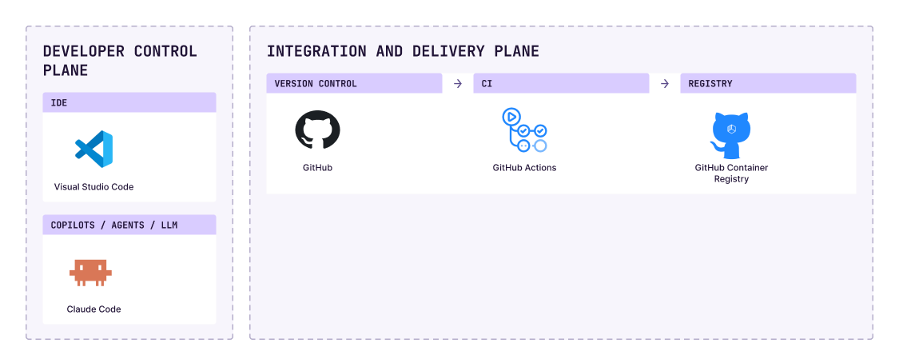

# Documentazione engineering H-EALTH

Questo repository raccoglie la documentazione dell'infrastruttura di sviluppo e rilascio dei
prodotti H-EALTH: come è fatta la piattaforma di sviluppo, come si usa per portare una modifica in
produzione, e quali decisioni l'hanno plasmata.

## Panorama degli strumenti

Lo schema qui sotto riassume gli strumenti della piattaforma per piano: ambiente di sviluppo
(Visual Studio Code, Claude Code) e integrazione e rilascio (GitHub, GitHub Actions, GitHub
Container Registry). 

## Indice

- [Repository `platform`](docs/README.md) (`v0.4.0`): principi, workflow riusabili e stato
  dell'enforcement. Per chi mantiene la piattaforma o scrive i workflow di un prodotto.
- Un documento per flusso:
  - [CI del prodotto](docs/ci.md): componenti e manifest `component.yaml`, job su PR e `main`,
    cosa fare quando `discover` o `scan` falliscono;
  - [Rilascio del prodotto](docs/release.md): tag, Release con digest e prove, errori comuni;
  - [Rilascio di `platform`](docs/versionamento.md): tag, numerazione, cambi incompatibili.
- [Decisioni (ADR)](docs/adr/): il perché delle regole citate nei workflow.
