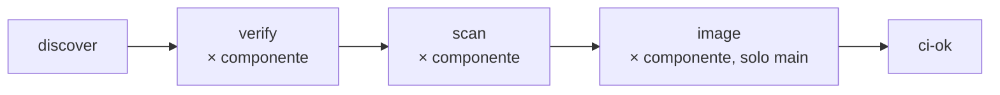

# Flusso CI del prodotto

Parte su ogni pull request e su ogni push su `main`, dal `ci.yml` del prodotto (template
[`app-web`](https://github.com/H-EALTH/app-web)). Sulla PR verifica e scansiona i sorgenti; dopo
il merge su `main` costruisce, pubblica e scansiona anche un'immagine per componente.



## Componenti e manifest

Un componente è una cartella che contiene un `component.yaml`, a qualunque profondità tranne la
radice del repo. Nel template i componenti stanno in `app/`, ma è solo una convenzione.

```yaml
# app/backend/component.yaml
kind: python
```

- `kind` è l'unica chiave ammessa e sceglie la stazione di verifica. Oggi esiste solo `python`
  (`verify-python`, artefatto immagine; file obbligatori `Dockerfile` e `pyproject.toml`).
- Il nome del componente è il nome della cartella: minuscolo (lettere, cifre, `.` `_` `-`) e
  unico nel repository. È anche il nome dell'immagine su GHCR.
- Una cartella senza `component.yaml` non è un componente. Aggiungere o togliere un componente
  vuol dire creare o cancellare la cartella con il suo manifest: i workflow non si toccano.

## Job

| Job | Stazione `platform` | Quando | Risultato |
|---|---|---|---|
| `discover` | `discover.yml` | sempre | lista dei componenti per genere |
| `verify (<nome>)` | `verify-python.yml` | PR e `main` | artifact `junit-<nome>` (30 giorni) |
| `scan (<nome>)` | `scan.yml` | PR e `main` | artifact `scan-<nome>` (90 giorni) |
| `image (<nome>)` | `image.yml` | solo push su `main` | `ghcr.io/h-ealth/<prodotto>/<nome>:sha-<short>`, artifact `scan-<nome>-image` |
| `ci-ok` | — | sempre | verde se tutti gli altri sono `success` o `skipped` |

`ci-ok` ha un nome fisso ed è l'unico check da richiedere nella branch protection: i nomi dei job
in matrix cambiano con i componenti.

## Quando `discover` fallisce

`discover` fa fallire la CI invece di ignorare un componente fatto male. Il messaggio indica il
file e la causa.

| Causa | Esempio |
|---|---|
| nessun `component.yaml` nel repository | |
| manifest nella radice del repo | `./component.yaml` |
| manifest non valido | file vuoto, lista, chiave sconosciuta (`knd: python`) |
| `kind` mancante o sconosciuto a `platform` | `kind: rust` |
| `kind` non gestito dal prodotto | `kind` noto a `platform` ma assente da `kinds` nel `ci.yml` |
| nome non valido o duplicato | `Backend/`, oppure `app/api` e `tools/api` |
| file obbligatorio mancante | `kind: python` senza `pyproject.toml` |

Il `ci.yml` del prodotto passa a `discover` l'input `kinds` con i generi per cui ha un job
(`kinds: python`). Un genere nuovo richiede la sua stazione in `platform`, i job `verify`, `scan`
e `image` sulla sua lista nel `ci.yml` del prodotto e l'aggiunta a `kinds`.

## Quando `scan` fallisce

Trivy ha trovato una vulnerabilità `CRITICAL` con fix disponibile, un segreto o un errore nel
Dockerfile. Il passo **Riepilogo nel log e nel summary del run** ha una riga per problema.

- c'è una versione corretta: aggiornare la dipendenza o l'immagine base;
- è un segreto: toglierlo e **ruotarlo subito**, cancellare il commit non basta;
- non c'è fix e il rischio è registrato come anomalia (`HE-SOP-006`): aggiungere l'id CVE a
  `<componente>/.trivyignore`, con il riferimento all'anomalia in commento.

## Dependabot

Il `dependabot.yml` del prodotto aggiorna il tag di `platform` (`github-actions`) e le dipendenze
`pip` e `docker` di ogni cartella sotto `app/` (glob `/app/**`). Dependabot non legge i
`component.yaml`: un componente fuori da `app/` va aggiunto a mano.
