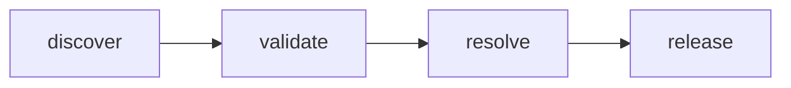

# Flusso di rilascio del prodotto

Parte al push di un tag `<prodotto>-vX.Y.Z`, dal `release.yml` del prodotto. Non costruisce
nulla: ritrova gli artefatti che la [CI](ci.md) ha già pubblicato da `main` per il commit
taggato, ci aggiunge il tag di rilascio e crea la Release con i digest e le prove.

## Prerequisito

Il commit taggato deve avere un run `ci` verde su `main`. Senza, le immagini `sha-<short>` non
esistono e il rilascio si ferma.

## Creare il tag

- da riga di comando: `git tag <prodotto>-v1.2.0 && git push origin <prodotto>-v1.2.0`;
- dalla UI: **Releases → Draft a new release → Create new tag**, target `main`. Il workflow
  completa la Release già creata invece di crearne una nuova.

Altre forme (`v1.2.0`, `<prodotto>-1.2.0`) fanno fallire `validate`. Ultima cifra per le
correzioni, seconda per le funzionalità, prima per le modifiche incompatibili.

## Job

| Job | Dove | Cosa fa |
|---|---|---|
| `discover` | `discover.yml` | un ref `ghcr.io/h-ealth/<prodotto>/<nome>` per componente, dai `component.yaml` del commit taggato |
| `validate` | `release.yml` | il tag deve essere `<prodotto>-v<major>.<minor>.<patch>` |
| `resolve` | `release.yml` | risolve `sha-<short>` nel digest e aggiunge il tag di rilascio; SBOM delle immagini con syft; recupera i report Trivy e JUnit dal run `ci` verde |
| `release` | `release.yml` | crea o completa la Release: lista dei digest nelle note, allegati |

Il prodotto chiama `release.yml` con `contents: write`, `packages: write`, `actions: read`: un
workflow chiamato non può avere più permessi di chi lo chiama.

## Allegati della Release

| Allegato | Contenuto | Colonne del `.csv` |
|---|---|---|
| `artifacts.txt` | un `ref@digest` per componente | |
| `security.zip` | `<c>-trivy-fs.*`, `<c>-trivy-image.*` | `target, kind, severity, id, package, installed, fixed, status, title, url` |
| `SBOM.zip` | `<c>.spdx.json`, `<c>-sbom.*` | `type, name, version, supplier, license, purl` |
| `tests.zip` | `<c>-junit.*` | `suite, classname, test, result, time_s` |

Ogni prova è nel formato originale più una tabella `.txt` e un `.csv`. La SBOM elenca ciò che è
dentro l'immagine: le dipendenze di sviluppo non compaiono.

## Quando il rilascio fallisce

| Errore | Causa | Cosa fare |
|---|---|---|
| `…:sha-… non esiste` o `nessun run ci verde` | tag creato prima che la CI di `main` fosse verde | cancellare Release e tag, aspettare la CI, ricreare |
| `artifact scan-*/junit-* non trovati` | commit troppo vecchio (Trivy 90 giorni, JUnit 30) | rilasciare da un commit recente di `main` |
| `tag … non conforme` | nome del tag sbagliato | cancellare Release e tag, ricreare con `<prodotto>-vX.Y.Z` |
