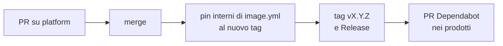

# Flusso di rilascio di `platform`

Ogni modifica a `platform` passa da PR e diventa disponibile ai prodotti solo con un tag
`vX.Y.Z`. I prodotti adottano la nuova versione con la PR di Dependabot.



## Passi

1. PR e merge su `main` di `platform`.
2. `image.yml` chiama `build-image` e `scan` con il tag completo, come i prodotti: prima di
   creare il tag si aggiornano quei riferimenti al nuovo tag (il riferimento si risolve quando il
   workflow gira, quindi il tag può citare sé stesso).
3. Tag `vX.Y.Z` e Release con le modifiche.
4. Nei prodotti Dependabot aggiorna il tag. Nomi di file, input, permessi e struttura dei job
   vanno aggiornati a mano nella stessa PR.

## Quale numero

| Cambio | Esempio |
|---|---|
| `patch` | correzione senza cambiare input, output o comportamento |
| `minor` | nuovo input opzionale, nuovo workflow, nuovo output |
| `major` | input rimosso o reso obbligatorio, comportamento che richiede modifiche nei prodotti |

Fino a `1.0.0` un cambio incompatibile può uscire come `minor`. Cambi che hanno richiesto
modifiche manuali nei prodotti:

| Versione | Cambio |
|---|---|
| `v0.2.0` | `ci-python` rinominato in `verify-python` |
| `v0.2.2` | `release` richiede `actions: read` |
| `v0.2.3` | cartelle `services/` rinominate in `components/` |
| `v0.2.4` | nuovo `image.yml` per la scoperta automatica dei componenti |
| `v0.3.0` | componenti dichiarati da `component.yaml` e nuovo `discover.yml` (ADR 0007): il prodotto aggiunge i manifest, chiama `discover.yml` in `ci.yml` e `release.yml` e usa `matrix.component.path` / `.name` |

## Pin delle action

Le action di terze parti sono pinnate allo SHA con il tag in commento, così Dependabot le
riconosce; quelle GitHub-owned (`actions/*`) al tag maggiore (ADR 0003).

```yaml
- uses: docker/login-action@dbcb813823bdd20940b903addbd779551569679f   # v4.6.0
```
